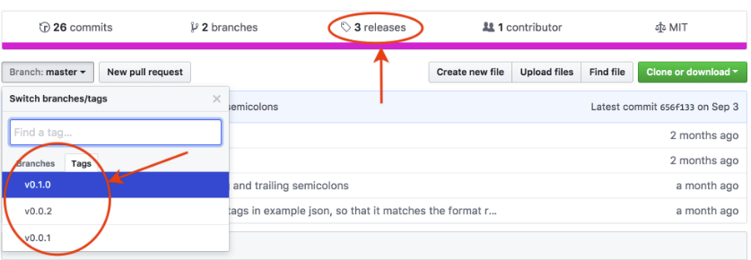

[Git tags](https://git-scm.com/docs/git-tag) are like bookmarks pointing to a specific _[commit](how-to-write-good-git-commit-messages.md)_. They are commonly used to mark important milestones, such as production releases.

### Why?

1. Mark release snapshots (e.g., `v1.0.0`)
2. Track significant changes
3. Simplify version management

### Types

* **Lightweight (default):**
	* Just a name for a commit (like a branch that never moves)
* **Annotated (recommended):**
	* Checksummed, including metadata (date, tagger, message, optional GPG signature)
	* Stored as full objects in the Git database

### Cheat Sheet

| Command                                         | Note                                                        |
| :---------------------------------------------- | ----------------------------------------------------------- |
| `git tag [-a] v1.0.0 [<commit_id>] [-m <msg>]`  | Create a tag (annotated with `-a` and `-m`)                     |
| `git tag <tag_name> HEAD`                       | Tag the latest commit                                       |
| `git checkout <tag_name>`                       | Check out a tag                                             |
| `git tag`                                      | List all tags                                               |
| `git tag -l "v1.1.*"`                          | Filter tags by pattern                                      |
| `git show <tag_name>`                           | Show tag details                                            |
| `git push origin <tag_name>`                    | Push a tag to remote (tags are not pushed by default)       |
| `git push origin --tags`                        | Push all tags to remote                                     |
| `git push --follow-tags`                        | Push only annotated tags                                    |
| `git tag --delete <tag_name>`                   | Delete a local tag                                          |
| `git tag \| xargs git tag -d`                    | Delete all local tags                                       |
| `git push --delete origin <tag_name>`           | Delete a remote tag                                         |
| `git tag \| xargs -n 1 git push origin --delete` | Delete all remote tags                                      |
